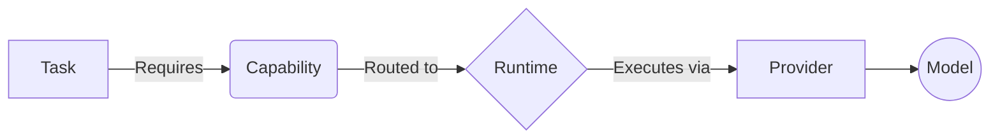

<div align="center">
  <h1>CRTX</h1>
  <p>
    <a href="https://github.com/Toxirrrr/CRTX/releases"></a>
    <a href="./LICENSE"></a>
  </p>
  <p><strong>A Provider-Neutral, Filesystem-Native Coordination Runtime for AI Teams</strong></p>
</div>

Every AI tool right now wants to own your entire workflow. They lock you into their IDE, tether you to their models, and constrain you within their context windows. 

**CRTX brings Git-like workflows to AI engineering.** It decouples the *work* from the *runtime*, turning isolated AI agents (Claude, Cursor, Aider) into a synchronized engineering team that coordinates entirely via the filesystem.

---

## The Architecture

Instead of sending massive prompts to a single model, CRTX routes work based on **Capabilities**.



To coordinate this without losing context, CRTX relies on a structured filesystem:
- 📁 **`tasks/`**: The workload and state machine.
- 📁 **`evidence/`**: Cryptographic proofs of successful execution.
- 📁 **`capsules/`**: Snapshot memory to pass context between agents without exploding token limits.
- 📁 **`decisions/`**: Immutable Architecture Decision Records (ADRs).
- 📁 **`skills/`**: Standard Operating Procedures for capabilities.

---

## Why CRTX?

| Problem | Typical Solution | CRTX Architecture |
|---------|------------------|-------------------|
| **Prompt history overflow** | Copy / Paste | 📦 **Capsules** (Deterministic state handoffs) |
| **Vendor lock-in** | Model-specific agents | 🚦 **Capability Routing** (Any runtime works) |
| **Context explosion** | Shared Chat Windows | 🗄️ **Structured Memory** (Filesystem-native) |

---

## Features
- **Zero Context Loss**: Resume complex refactoring tasks instantly after an IDE crash.
- **Provider Independence**: Seamlessly hand off a task from Claude to a Local LLaMA mid-workflow.
- **Verifiable Execution**: Code is only considered complete when cryptographic `Evidence` is generated.
- **IDE Agnostic**: Works perfectly alongside Cursor, Windsurf, Copilot, or CLI agents like Aider.

---

## 🚀 5-Minute Quick Start

Get CRTX up and running in your local environment immediately.

**1. Clone & Install**
```bash
git clone https://github.com/Toxirrrr/CRTX.git
cd CRTX/crtx
npm install
```

**2. Verify Installation (Smoke Test)**
```bash
npm run demo
```
*Expected Output:*
```text
✓ Runtime initialized
✓ Tasks loaded
✓ Evidence created
✓ Capsule generated

Demo completed. Your environment is ready for Capability Routing.
```

*(For deeper onboarding and troubleshooting, see the **[Full Quickstart Guide](./QUICKSTART.md)**).*

---

## 🎬 Demo

*(Insert GIF here showing a 30-second multi-agent handoff inside Cursor/Windsurf)*

---

## 📚 Examples & Tutorials

We have prepared standalone, reproducible examples that demonstrate CRTX in action. See the **[Examples Index](./examples/README.md)**.
- **[01. Multi-Agent Handoff](./examples/01-multi-agent-handoff)**: The core CRTX capability loop.
- **[02. Chat Recovery](./examples/02-chat-recovery)**: Zero context loss after an IDE crash.
- **[03. Provider Switch](./examples/03-provider-switch)**: Swapping from Claude to Gemini.

---

## 📖 Documentation

- **[Repository Tour](docs/REPOSITORY_TOUR.md)**: What every folder does.
- **[Design Principles](docs/DESIGN_PRINCIPLES.md)**: The architectural tenets of CRTX.
- **[FAQ](FAQ.md)**: Why we didn't use LangGraph, AutoGen, or GitHub Issues.
- **[Project Status](PROJECT_STATUS.md)**: What is stable vs. experimental.
- **[Releases](docs/RELEASES.md)**: Versioning and stability policy.

---

## 🗺 Roadmap & Changelog
- **[Roadmap](ROADMAP.md)**
- **[Changelog](CHANGELOG.md)**

---

## 🤝 Contributing
We aim to build the industry standard for open-source AI orchestration. Please read our **[Contributing Guide](CONTRIBUTING.md)** and review our **[GitHub Labels](docs/GITHUB_LABELS.md)** before submitting a PR.
- **[Security Policy](SECURITY.md)**

## License
MIT License. Free forever. Fork it, improve it, make it yours.
