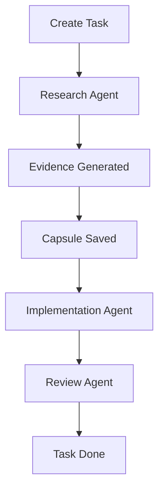

# Example 1: Multi-Agent Handoff

This is the primary scenario that explains the value of CRTX in 3 minutes.

## The Problem
When you ask an AI assistant to "research an API and then write the code", it usually does it in one giant, unstructured context window. If the task is large, it forgets constraints, hallucinates architectures, and creates a mess.

## The CRTX Solution
CRTX decouples the workflow. One agent (e.g., Windsurf or Gemini) performs the research and creates a structured **Capsule** and **Evidence**. Another agent (e.g., Cursor or Claude) reads that capsule and writes the code.

## What this demonstrates:
- A task is created in `tasks/`.
- The first runtime produces cryptographic/structural `evidence/`.
- The state is frozen into `capsules/`.
- A second, completely different runtime resumes the task **without needing you to copy-paste context**.
- The task is closed cleanly.
